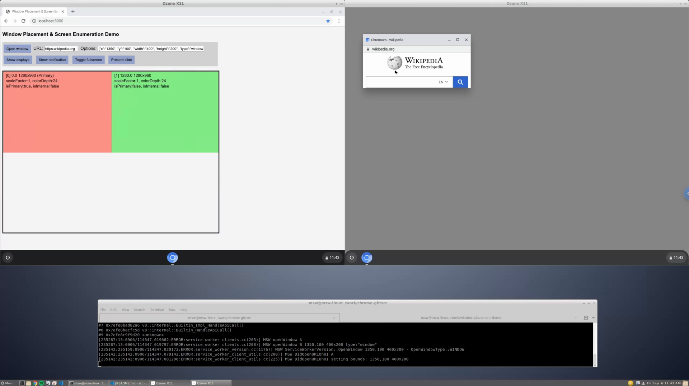

# Window Placement and Screen Enumeration APIs Demo

## Abstract

This is a basic demo of the proposed
[Screen Enumeration](https://github.com/spark008/screen-enumeration) and
[Window Placement](https://github.com/spark008/window-placement) APIs.

This demo depends on recent work and unmerged changes to Chrome:
* [Screen Enumeration: Basic Implementation](https://chromium-review.googlesource.com/c/chromium/src/+/1759890)
  * Available on Chrome 78 Canary and Dev channels.
* [\[WIP\] Fugu: Exploring new openWindow options](https://chromium-review.googlesource.com/c/chromium/src/+/1767282)
  * Unmerged, local build needed to call openWindow() with options.

## Screen Capture

Demo screen capture: linux-chromeos with two virtual displays draws a screen-space diagram and opens windows on both displays 

