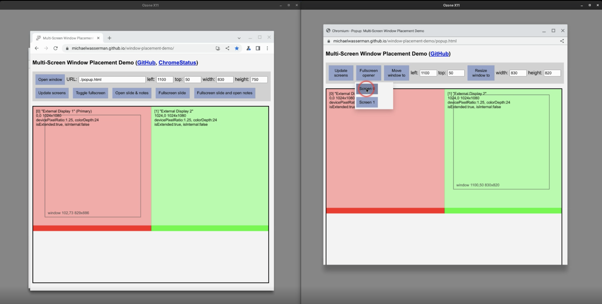

# Multi-Screen Window Placement Demo

## Abstract

This is a demo of [Window Management](https://w3c.github.io/window-management/) APIs,
which launched in Chrome 100 ([ChromeStatus](https://chromestatus.com/feature/5252960583942144)), and some enhancements:
* Fullscreen Companion Window launched in Chrome M104 ([ChromeStatus](https://chromestatus.com/feature/5173162437246976))
* Fullscreen Capability Delegation launched in Chrome M104 ([ChromeStatus](https://chromestatus.com/feature/6441688242323456))
* Accurate Screen Labels launched in Chrome M105 ([ChromeStatus](https://chromestatus.com/feature/6317530778959872)) 
* Fullscreen Popups are available with a flag in Chrome M113+ ([ChromeStatus](https://chromestatus.com/feature/6002307972464640)) 
  * Enable chrome://flags/#fullscreen-popup-windows to demo this functionality

## Instructions

Run the demo on Chrome 105+ at https://michaelwasserman.github.io/window-placement-demo

* See a screen arrangement visualization that updates on changes
* Place fullscreen content and windows on specific screens
* Request fullscreen and open a popup via 'Fullscreen slide an open notes' (or press the "s" key) with 2+ screens
* Request fullscreen from another window via 'Fullscreen opener' (or press the "s" key) on a popup with 2+ screens

**[Optional]** Host this demo locally and run it:
```console
$ git clone https://github.com/michaelwasserman/window-placement-demo.git
$ cd window-placement-demo
$ python -m http.server &
$ chrome -- "http://localhost:8000"
```

To simulate multiple displays with
[linux-chromeos](https://chromium.googlesource.com/chromiumos/docs/+/master/simple_chrome_workflow.md)
builds, use
[--ash-host-window-bounds](https://cs.chromium.org/chromium/src/ui/display/display_switches.cc?type=cs&q=ash-host-window-bounds&sq=package:chromium&g=0&l=34-40):
```console
$ out/cros_Default/chrome --ash-host-window-bounds=1280x960,1285+0-1280x960 -- "http://localhost:8000"
```

## Screen Capture

This screen capture shows some functionality on linux-chromeos with two virtual displays

<a href="enhancement_screen_capture.webm"></a>
